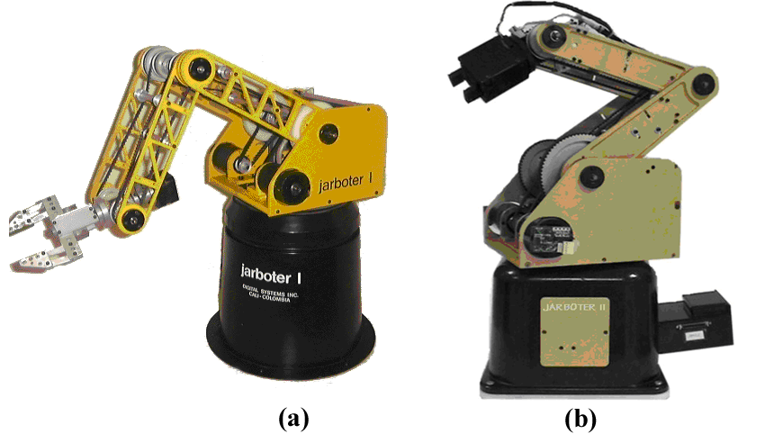
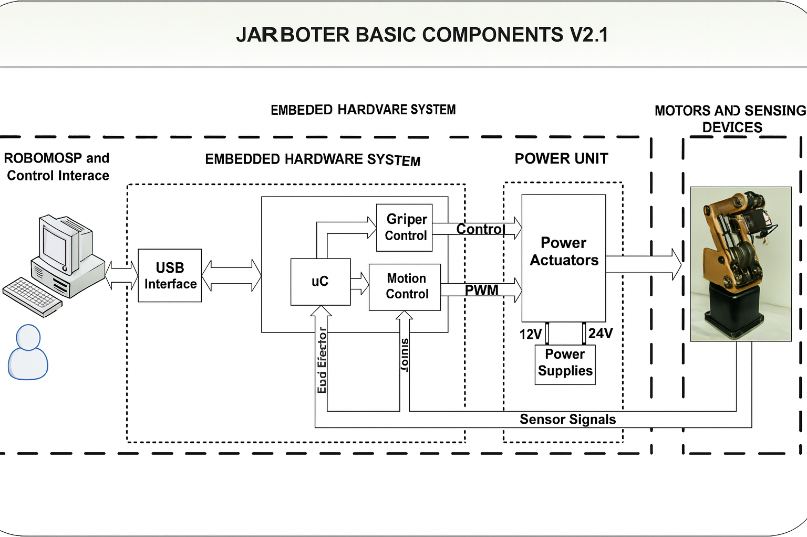

# JARBOTER V2.1 – Robotic Manipulator Controller (Hardware + Software Co-Design)

## Project Overview



This project consists of the design and implementation of a complete electronic controller (hardware + software) for a 6-DoF didactic robotic manipulator called **JARBOTER V2.1**.

The goal was to replace a non-functional legacy controller with a new, open and stand-alone architecture based on a distributed system:

- **PC** for kinematics, trajectory planning and simulation  
- **Embedded controller** for real-time coordination of the axes  
- **Motion control boards + power stage** to drive the motors  
- **Sensors and safety signals** (encoders, Hall sensors, limit switches, emergency stop)

Once trajectories are downloaded from the PC, the system can operate as a **stand-alone controller**.

## Key Results

- Fully working hardware + firmware architecture for a 6-DoF robotic manipulator.
- Reliable USB 2.0 communication between PC and embedded controller.
- Multi-axis motion control using dedicated motion control chips (PMD MC2400).
- Integrated feedback from optical encoders, Hall sensors and limit switches.
-  controller: standard interfaces (USB, UART, I²C) and documented architecture.

## Hardware Architecture (High-Level)



```text
                 +-------------------------------------+
                 |        PC / ROBOMOSP Platform       |
                 | - Robot modeling & simulation       |
                 | - Trajectory planning (IK/DK)       |
                 | - Control GUI                       |
                 +-----------------+-------------------+
                                   |
                                   |  USB 2.0 (FX2)
                                   v
       +--------------------------------------------------------+
       |           Embedded Controller Board (ATmega1280)       |
       |  - USB interface (CY7C68013 FX2 + GPIF)                |
       |  - ATmega1280 MCU (sequencer / host for PMDs)          |
       |  - External SRAM / EEPROM                              |
       |  - RTC, debug UART, LCD, buzzer                        |
       |  - Emergency stop input                                |
       +-----------------+----------------------+---------------+
                         |                      |
                         | Backplane bus        | Sensor I/O
                         v                      v
          +--------------------------+     +------------------------+
          |   PMD Motion Controller  |     |  Signal Acquisition    |
          |   Boards (MC2400)        |     |  Board                 |
          | - Up to 12 axes          |     | - Encoders             |
          | - Position/vel/accel     |     | - Hall sensors         |
          +-------------+------------+     | - Limit switches       |
                        |                  +-----------+------------+
                        v                              |
                 +--------------+                      v
                 | Power Stage  |              +--------------------+
                 | - Logic &    |              |  JARBOTER V2.1     |
                 |   motor PSUs |              |  Manipulator       |
                 +------+-------+              +--------------------+
                        |
                        v
                 Actuators (motors + gripper)

```

## Software Architecture (High-Level)

```text

PC Side
-------
[User]
   |
   v
+-------------------------------+
| Control GUI                   |
| - Load/simulate trajectories  |
| - Configure motion profiles   |
+-------------------------------+
               |
               v
+-------------------------------+
| ROBOMOSP Engine               |
| - Robot model & kinematics    |
| - Trajectory generation       |
+-------------------------------+
               |
               v
+-------------------------------+
| USB Communication Layer       |
| - Packet protocol             |
| - Error handling              |
+-------------------------------+
               |
               | USB 2.0
               v

Embedded Firmware (ATmega1280)
------------------------------
+-------------------------------+
| USB Driver + GPIF Interface   |
+-------------------------------+
               |
               v
+-------------------------------+
| Command Decoder & State Machine|
| - Idle / Download / Execute   |
| - Error handling              |
+-------------------------------+
               |
               v
+------------------------------------------------------+
|          Motion, Sensors & System Services           |
+---------------------+----------------+---------------+
| Motion Control      | Sensors & I/O  | System        |
| - PMD command API   | - Encoders     | - RTC tasks   |
| - Multi-axis sync   | - Hall, limits | - Debug UART  |
|                     | - Gripper      | - Error log   |
+---------------------+----------------+---------------+

